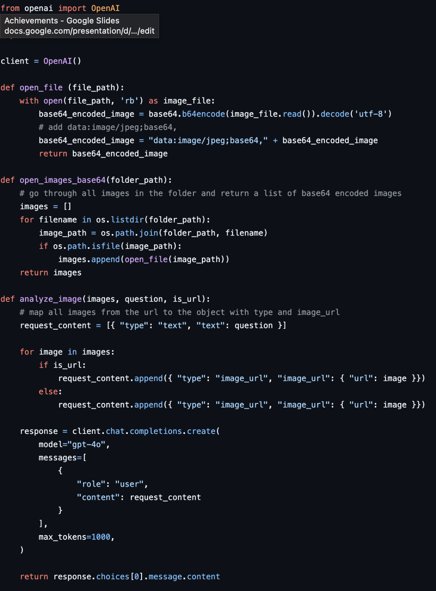
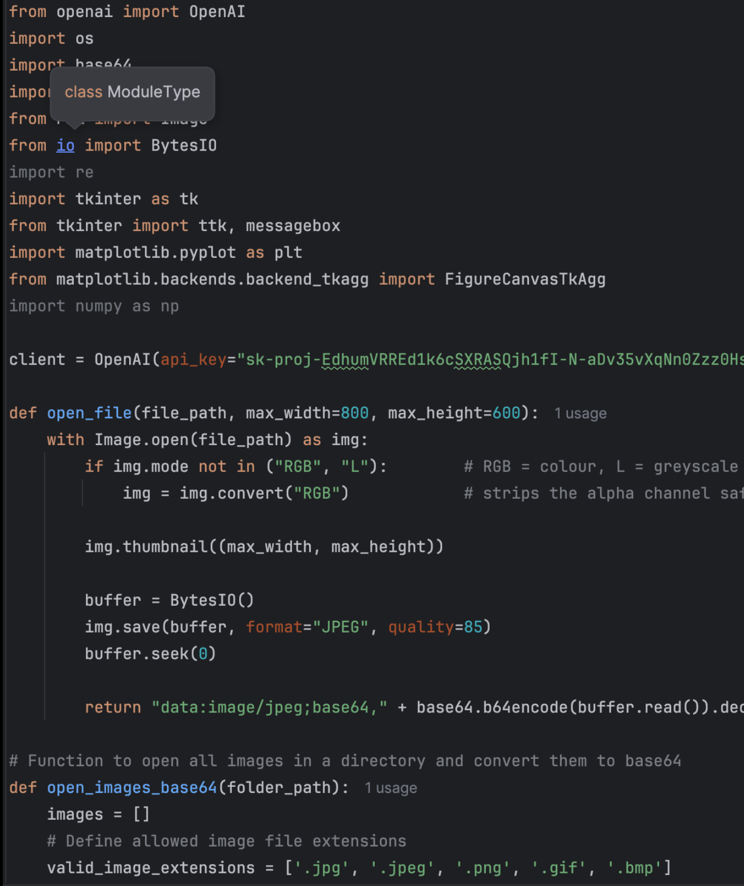
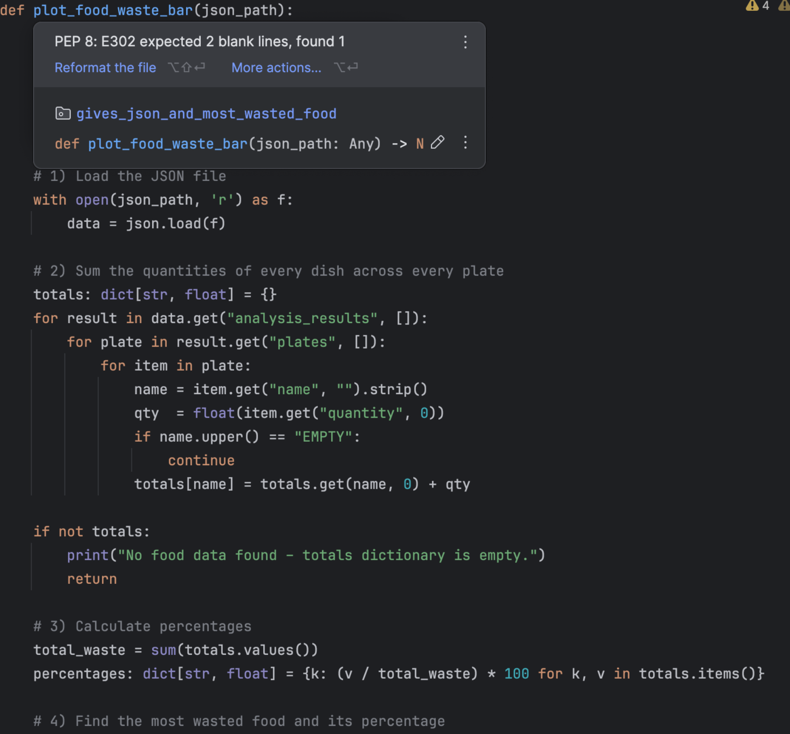
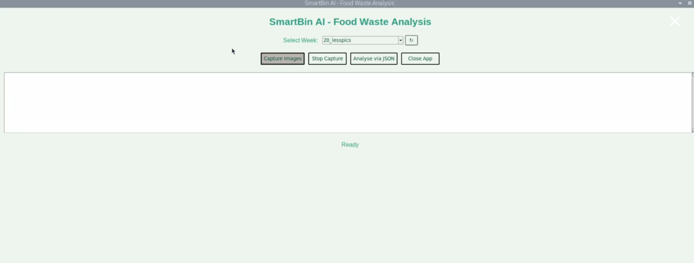
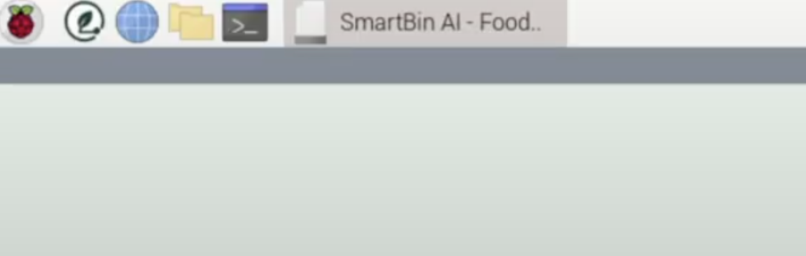
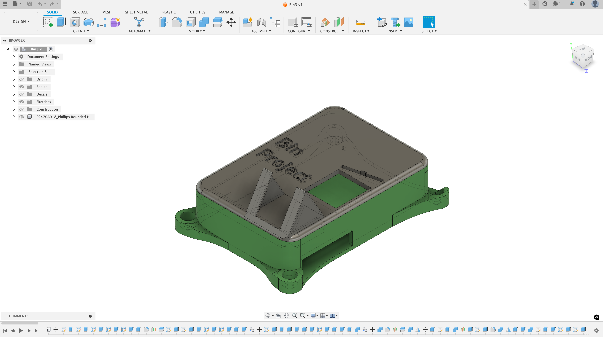
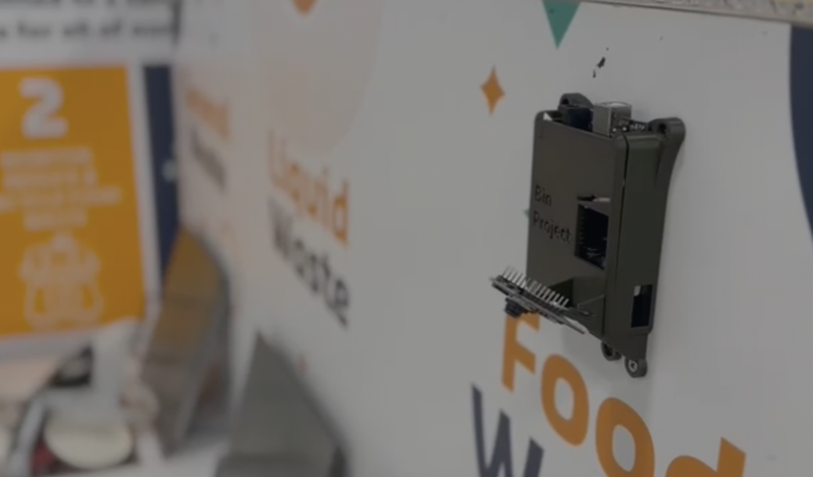

## Devlogs

- **July 23 (10 days ago)** – Took quite long to complete the next part but I got it done!!! I managed to change the UI interface from terminal or command prompt to a Graphical User Interface using the Tkinter Python library.

- **July 23 (10 days ago)** – I completed the part of the code that takes images from a folder and converts them into base64. Since computers can’t process images, it requires the image in base64 format, which is a text format for the computer to understand the picture.

- **July 25 (8 days ago)** – Completed making the model where I am connecting my Python code with the gpt-4o model specifically for image classification. Moreover, I created a detailed `prompt.txt` (more than 200 lines of code).

- **July 26 (7 days ago)** – Finally completed the script that constantly takes images every 0.25 seconds and saves it if it satisfies the Region of Interest (ROI) function for plate detection. Now I am going to focus on developing the Graphical User Interface (GUI).

- **July 30 (3 days ago)** – I completed the combining of the code as well as the UI interface for the COMPLETE app. This means that the user can simply use it as if it was a web app they were launching! I made this using Tkinter and Python, really happy with this.

- **July 31 (2 days ago)** – I finally just finished! I configured the Raspberry Pi OS to also show my app in the desktop as well as the side bar.

- **July 31 (2 days ago)** – I made a CAD Design of the whole model on fusion 360 and then 3d printed it out! Check the later images to see the project actually being setup in the school!!!

