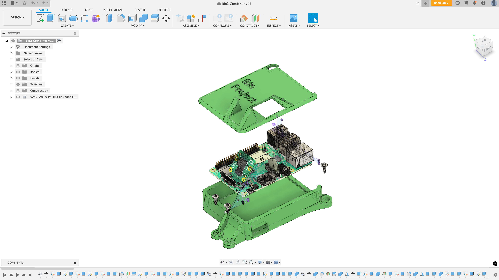

# SmartBin AI

SmartBin AI is a module that reduces food waste using artificial intelligence. It works by placing a camera setup above a school's cafeteria or kitchen bin, where food waste is usually thrown away by students. When a plate is detected, it captures an image and sends it through a CNN model that identifies the type of food and estimates the amount of waste.

Every month, it automatically generates a report based on the collected data. This report is sent to the food provider with suggestions, like adjusting portion sizes for meals that are often left unfinished.

I created this project after viewing first hand the amount of food waste the average school cafeteria or any kitchen in general produces. I figured that if such organisations could know what their most significant food waste was they can reduce the portion size of it, ultimetly reducing the amount of food waste!

## How it works

1. The module waits for a plate to appear in its field of view.
2. Once a plate is detected, it takes a photo.
3. The photo is passed to an AI model that:
   - Detects food items.
   - Estimates the percentage of food left.
4. The data is logged and included in a monthly report.

## Hardware

- Raspberry Pi 4 or 5 (depending on model performance)
- Camera module (set up above the bin)
- Optional: enclosure for weather or mess protection

## Software

- Python (main language)
- OpenCV (for image processing)
- TensorFlow or PyTorch (used to train the CNN)
- Optionally connected to Google Sheets or a dashboard to show live data

## Use case

This was made mainly for school cafeterias, but it can be used anywhere food is served in bulk — like buffets, hostels, or events. The goal is to give kitchens real data about what people are wasting, so they can make smarter decisions on what and how much to serve.

## Folder structure

- `capture/` – handles camera feed and image saving
- `model/` – contains the trained CNN model
- `reporting/` – generates monthly insights
- `scripts/` – extra tools for calibration or manual testing

## Setup

1. Clone the repo to your Raspberry Pi.
2. Make sure your environment has Python and the required libraries (`pip install -r requirements.txt`).
3. Run the main script:  
   `python3 run.py`
4. Position the module so it clearly sees the bin and plate area.

## Notes

- This is still being improved based on real-world testing.
- The accuracy improves as more training data is added from different schools or food types.
- One limitation is lighting – it works best in areas with consistent light.

# 3D CAD made on Autodesk Fusion360

# SmartBin AI – Budget Breakdown (USD $330)

SmartBin AI is an AI-powered system to detect and analyze food waste in schools, canteens, or kitchen settings using a Raspberry Pi, camera, and lightweight machine learning models. Below is the detailed breakdown of how to spend a $330 budget to build and deploy the system.

## 1. Core Hardware – $140

| Item                                | Cost (USD) | Notes                                      |
|-------------------------------------|------------|--------------------------------------------|
| Raspberry Pi 5 (4GB)                | $80        | Main processor for AI tasks                |
| Official Raspberry Pi Power Supply  | $10        | Ensures stable power                       |
| 64GB MicroSD Card (Class A1)        | $10        | Storage for OS and images                  |
| Heatsink + Cooling Fan              | $10        | Prevents thermal throttling                |
| Pi Camera v2  | $30        | For high-resolution image capture          |

## 2. Mounting + Build Materials – $40

| Item                         | Cost (USD) | Notes                                      |
|------------------------------|------------|--------------------------------------------|
| 3D Printing Filament (1kg PLA) | $25       | For printing camera and Pi mounts          |
| Misc Hardware (screws, cable ties, Velcro) | $10 | For assembling and securing parts          |
| Flexible Camera Cable | $5 | Needed for positioning the camera          |

## 3. AI + Software – $20

| Item                           | Cost (USD) | Notes                                      |
|--------------------------------|------------|--------------------------------------------|
| Python + OpenCV + YOLOv5       | $0         | Installed via pip                          |
| OpenAI API Credits             | $10        | For plate detection and classification     |
| AWS S3 Bucket or Google Drive  | $10        | For storing images or logs remotely        |

## 4. Dashboard and Hosting – $30

| Item                              | Cost (USD) | Notes                                      |
|-----------------------------------|------------|--------------------------------------------|
| Shared Hosting (1 year)           | $24        | WordPress or static dashboard              |
| Custom Domain (e.g. .xyz)         | $6         | For professional project link              |

## 5. Portable Setup and Expansion – $40

| Item                          | Cost (USD) | Notes                                      |
|-------------------------------|------------|--------------------------------------------|
| Power Bank (10,000 mAh)       | $20        | To operate SmartBin without wall power     |
| USB Flash Drive (128GB)       | $10        | For offline backups or exports             |
| Small Tripod or Clamp Stand   | $10        | Optional alternative to 3D printed mount   |

## 6. Testing and Contingency – $60

| Item                                     | Cost (USD) | Notes                                      |
|------------------------------------------|------------|--------------------------------------------|
| Feedback Incentives (student rewards)    | $30        | Tokens or vouchers for pilot testers       |
| Extra SD Card, Cables, Misc Replacements | $20        | For quick part replacement during trials   |
| QR Code Stickers, Labels, Printouts      | $10        | For project branding and instructions      |

## Total: $330
